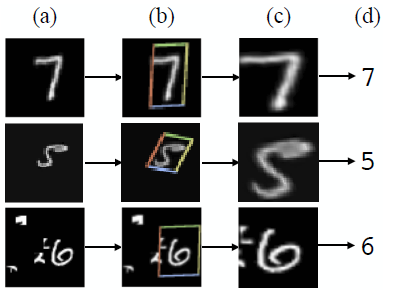

## Assignment 12:  Spatial Transformer

### Need of transformers?

So far, CNNs have dominated computer vision tasks. The notion behind an image is that one pixel is dependent on its immediate neighbours, and the next pixel is dependent on its immediate neighbours (be it color, brightness, contrast, and so on). CNN's work is based on this concept, and it extracts significant features and edges by applying filters to a section of a picture. This allows the model to learn only the most significant elements from an image, rather than the fine details of each pixel.

The chances of a model working better are higher if the complete image data is put into it, rather than only the sections that the filters can extract. This is precisely what takes on within a Visual Transformer.

### Submission Links:

Colab notebook: https://colab.research.google.com/drive/1XRaL8ThGma1WZ5BwTKDhFFW5nHIdyApm?usp=sharing

Github notebook:

Readme of ViT: 

### Spatial Transformer

**Google DeepMind's** **Spatial Transformer Network (STN)** assists in cropping out and scaling-normalizing the suitable region, which can simplify the future classification process and improve classification performance.

**(a) Input Image with Random Translation, Scale, Rotation, and Clutter, (b) STN Applied to Input Image, (c) Output of STN, (d) Classification Prediction**

Source: https://towardsdatascience.com/review-stn-spatial-transformer-network-image-classification-d3cbd98a70aa

A Spatial Transformer Network (STN) is a learnable module that can be used to boost spatial invariance in a Convolutional Neural Network (CNN) in a cost-effective manner. The invariance of a model to spatial transformations of pictures such as rotation, translation, and scaling is known as spatial invariance. Invariance is the ability of the model to recognize and identify features even when the input is transformed or slightly modified. Spatial Transformers can be placed into CNNs to benefit various tasks.

**A Spatial Transformer Network consists of 3 main components:**

**(i) Localization Network** :  A 4D tensor representation of a batch of images (Width x Height x Channels x Batch Size according to Flux rules) is fed into this network. It's a straightforward neural network with a few dense layers and a few convolutional layers. It forecasts the transformation parameters as an output. These parameters determine the angle by which the input has to be rotated, the amount of translation to be done, and the scaling factor required to focus on the region of interest in the input feature map.

**(ii) Sampling Grid Generator :** For each image in the batch, the transformation parameters predicted by the localization net are employed in the form of an affine transformation matrix of size 2 x 3. An affine transformation keeps points, straight lines, and planes intact. After affine transformation, parallel lines stay parallel. Affine transformations include rotation, scaling, and translation.

**(iii) Bilinear Interpolation on transformed indices :** The image's indices and axes have now undergone affine modification. As a result, its pixels have shifted. For example, after rotating the axes 45 degrees counter clockwise, a point (1, 1) becomes (√2, 0). So, using the four closest pixel values, we must conduct bilinear interpolation to determine the pixel value at the changed location.

**References:**

- https://pytorch.org/tutorials/intermediate/spatial_transformer_tutorial.html
- https://manjunathbhat9920.medium.com/spatial-transformer-network-82666f184299
- https://towardsdatascience.com/review-stn-spatial-transformer-network-image-classification-d3cbd98a70aa
- https://arxiv.org/abs/1506.02025