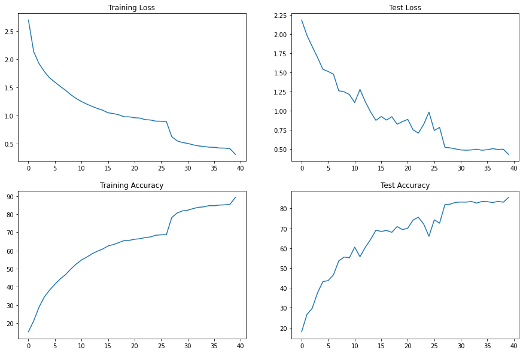
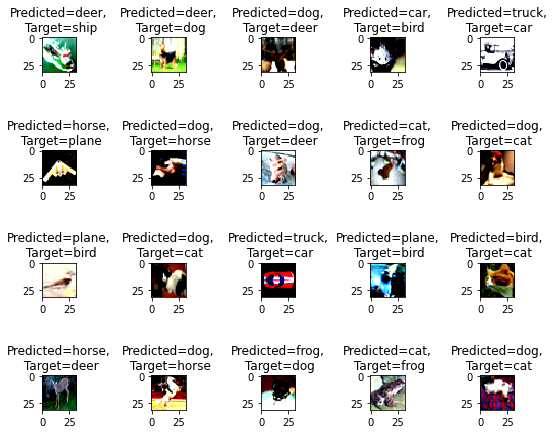
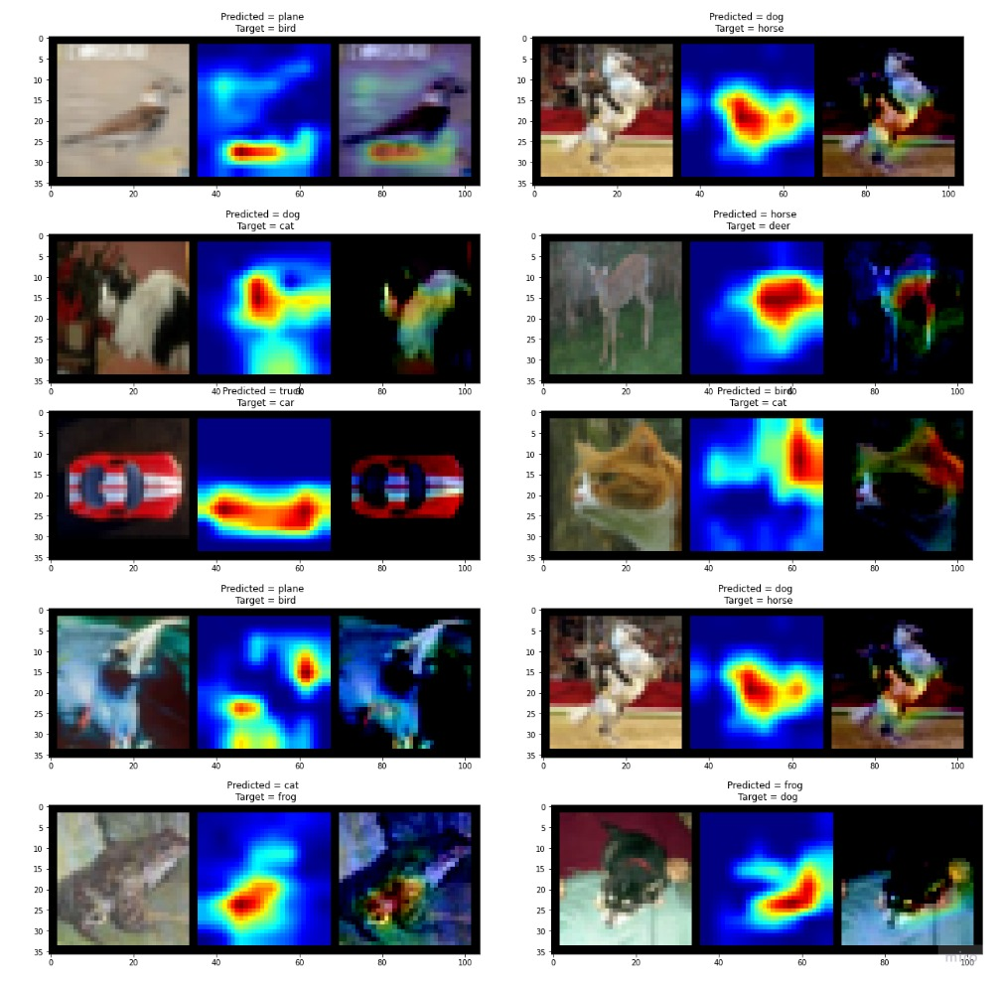
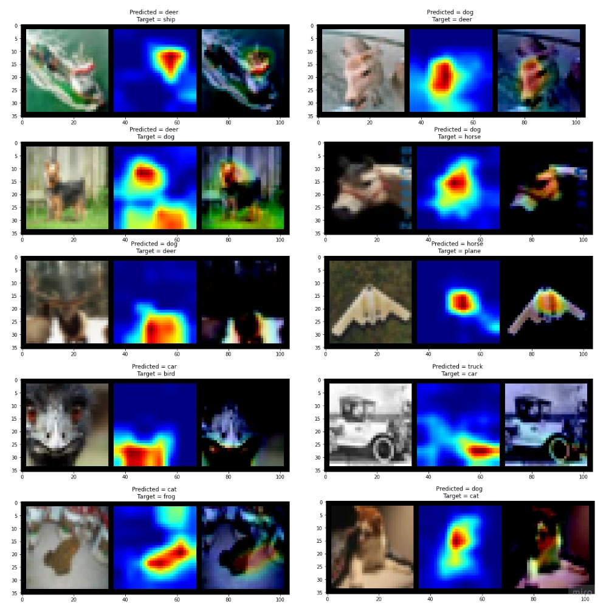

#### Problem Statement

1. Train for 40 Epochs
2. **20** misclassified images
3. **20** GradCam output on the **SAME misclassified images**
4. Apply these transforms while training:
   1. RandomCrop(32, padding=4)
   2. CutOut(16x16)
   3. **Rotate(±5°)**
5. **Must** use ReduceLROnPlateau
6. **Must** use LayerNormalization ONLY

#### File Structure

- `main.py`
  - `get_data_loader()` -> Returns train test data loader for the given dataset and batch size.
  - `get_model()` -> Returns requested model from model directory
  - `set_model_config()` -> It sets model config like optimizer, scheduler, type of device, learning rate.
  - `train()` -> Contains training logic of the model
  - `test()` -> Contains testing logic of the model
  - `training_loop()` -> Contains logic of training and testing the model for the given number of epochs.
- utils
  - `Albumentationtransform.py` -> Contains logic for albumentation transformation.
  - `generic_func.py` -> Contains functions for downloading train and test set and plotting curves after model training.
  - `gradcam.py` -> Contains logic code for gradcam
  - `utils_grad_cam.py` -> Contains utils functions for gradcam
  - `missclassified_images.py` -> Contains function to plot miss classified images by inference on test loader. 
- models
  - `resnet.py` : Contains model code for resnet18 and resnet34

> Link to module files : https://github.com/aditdoshi333/module_files_cv

#### Model

- Epochs - 40
- Normalization - LayerNorm
- LR Scheduler - ReduceLROnPlateau

Link to model : https://github.com/aditdoshi333/module_files_cv/blob/master/models/resnet.py

#### Data Augmentation

- Normalization
- Random Crop
- Rotatation (+5 -5)
- Cutout
- Shiftscale Rotate
- Grayscale

#### Training and testing graphs

#### Incorrect prediction

#### Gradcam results on incorrect predictions

